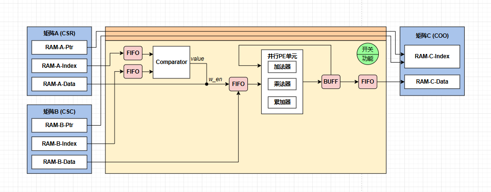

# 硬件架构设计文档

## 1.总架构设计图

## 2.数据流设计图

> 
### 说明（矩阵乘法）：
循环框架如下：
for(i=0,i<=A_row_MAX,i++)
    for(j=0,j<=B_col_MAX,j++)

首先读取矩阵A的第i（A的i行）、i+1个PTR，统计该行是否存在非零元素；读取矩阵B的第j（B的j列）、j+1个PTR，统计该列是否存在非零元素。在两者都不为0时打开主题数据流。然后依次将矩阵A的第i行、矩阵B的第j列索引分别依次送入两个FIFO中，比较器依次从FIFO中取两个数据比对。
    若A_index > B_index，则关闭FIFO_Index_A读使能，打开FIFO_Index_B的读使能，同时b_nnz_addr递增；
    若A_index < B_index，则打开FIFO_Index_A读使能，关闭FIFO_Index_B的读使能，同时a_nnz_addr递增；
    若A_index = B_index，则打开FIFO_Index_A和FIFO_Index_B的读使能，a_nnz_addr和b_nnz_addr递增，同时开启FIFO_Data写使能；

PE单元读取FIFO_Data数据（每个数据包含一对A、B元素），经过乘法/加法/累加，结果存入缓存16bit缓存buff中，待该位置全部累加完成后，将buff读入FIFO_C中，完成一个行列位置的整个流程。

本节使用的FIFO规格如下：

| FIFO | 宽度 | 深度 | 备注 |
|---|---|---|---|
| `FIFO_Index_A` | 16bit | 16 | 同步，读2写1 |
| `FIFO_Index_B` | 16bit | 16 | 同步，读2写1 |
| `FIFO_Data` | 32bit | 16 | 异步，读1写1 |
| `FIFO_C` | 16bit | 16 | 同步，读1写1 |
